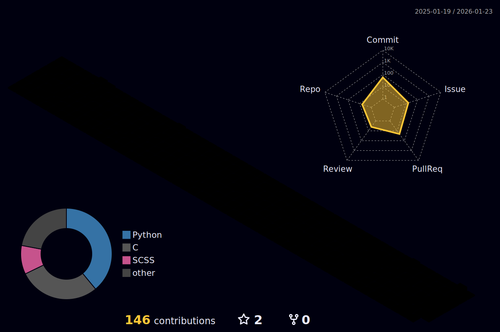

<div align="center">

# Hey, I'm Juan Reyes

[](https://git.io/typing-svg)

[](https://www.linkedin.com/in/juan-reyes1)
[](https://juan-reyes.com)
[](mailto:reyesj20703@gmail.com)

</div>

---

## About Me

```yaml
name: Juan Reyes
location: Ontario, Canada
education:
  school: McMaster University
  degree: B.Eng Mechatronics Engineering
  graduation: April 2026

current_focus:
  - Seeking Software, Robotics, Controls & Embedded positions
  - Building full-stack applications and embedded systems

experience:
  - role: Systems Quality Engineer (Co-op)
    company: Accipiter Radar Technologies
    duration: 2 years
```

I'm a Mechatronics Engineering student who loves building things that bridge the gap between software and hardware. Whether it's writing firmware for embedded systems, developing full-stack web applications, or training ML models — I'm always excited to tackle new challenges.

---

## Tech Stack

<div align="center">

### Languages


### Frameworks & Tools


### ML & AI


### Hardware & Embedded


</div>

---

## Achievements

```python
achievements = {
    "hackathons": {
        "Hack the North 2025": "1st Place - Canada's biggest hackathon",
    },
    "competitions": {
        "ACE @ University of Michigan": "5th Place - Automotive Competition",
    },
    "experience": {
        "Accipiter Radar Technologies": "2 years as Systems Quality Engineer",
    }
}
```

---

## GitHub Analytics

<div align="center">


</div>

<div align="center">

<a href="https://git.io/streak-stats"></a>

</div>

### Contribution Activity

<div align="center">

[](https://github.com/ashutosh00710/github-readme-activity-graph)

</div>

### 3D Contribution Graph

<picture>
  <source media="(prefers-color-scheme: dark)" srcset="./profile-3d-contrib/profile-night-rainbow.svg" />
  <source media="(prefers-color-scheme: light)" srcset="./profile-3d-contrib/profile-green-animate.svg" />
  
</picture>

---

## Beyond the Code

When I'm not coding or soldering circuits, you'll find me:

- **Rock Climbing** - Always chasing the next send
- **Making Music** - Piano, guitar, and drums
- **Playing Basketball** - Nothing like a good pickup game

---

<div align="center">

[](https://juan-reyes.com)

</div>
